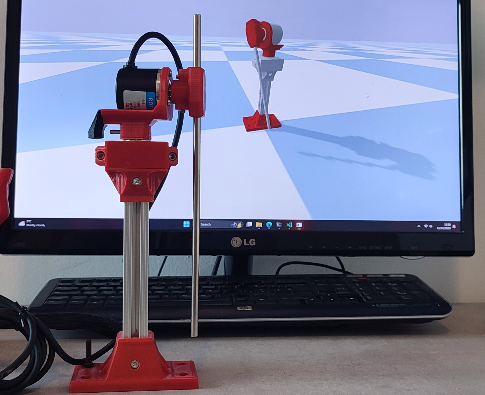

# Rotary-Pendulum-RL

[](https://github.com/PeriniM/Rotary-Pendulum-RL/graphs/contributors)
[](https://github.com/PeriniM/Rotary-Pendulum-RL/network/members)
[](https://github.com/PeriniM/Rotary-Pendulum-RL/stargazers)
[](https://github.com/PeriniM/Rotary-Pendulum-RL/issues)
[](LICENSE)

https://github.com/PeriniM/Rotary-Pendulum-RL/assets/19621159/0168d43d-66d2-4de8-862b-840ff1d75a66

<!--  -->
This is an open source project aimed at introducing people to **robotics**, from the hardware and embedded systems implementation to the software and control algorithms. The goal is to control a real life **rotary pendulum** to make it perform a swing-up and balance task.

The project is divided into four parts: **hardware**, **firmware**, **simulation** and **control**. The hardware part is responsible for the mechanical design and the electronic components. The firmware part is responsible for the embedded systems implementation. The simulation part is responsible for the simulation of the rotary pendulum in a virtual environment. The control part is responsible for the implementation of the control algorithms.


## [Documentation](https://rotary-pendulum-rl.readthedocs.io/)


## Folder Structure

```bash
├─── hardware
│   ├─── 3d_models
│   ├─── BOM
│   ├─── schematics
│   └─── instructions
│
├─── firmware
│   ├─── arduino
│   └─── platformio
│
├─── simulation
│   ├─── urdf
│   ├─── pybullet
│   └─── gazebo
│
├─── control
│   ├─── pid
│   ├─── optimal_control
│   └─── reinforcement_learning
│
└─── docs
    └─── assets
```
### 📂[hardware](hardware)

This folder contains the mechanical design and the electronic schematics as well as the instructions on how to build the rotary pendulum.
It will guide you through the process of 3D printing the parts, choosing the right mechanical and electronic components and assembling the rotary pendulum.

### 📂[firmware](firmware)

This folder contains the microcontroller code that will run on the embedded systems of the rotary pendulum.
It will guide you through the process of setting up the development environment, compiling and uploading the code to the microcontroller.

### 📂[simulation](simulation)

This folder contains the simulation code that will run on the computer. It will simulate the rotary pendulum in a virtual environment, such as the [PyBullet](https://pybullet.org/wordpress/) or [Gazebo](http://gazebosim.org/) simulators.

### 📂[control](control)

This folder contains the control code that will run on the computer. It will implement the control algorithms that will be used to control the rotary pendulum, from model-free to model-based control algorithms.

## Contributing

Contributions are what make the open source community such an amazing place to learn, inspire, and create. Any contributions you make are **greatly appreciated**.

If you want to contribute to this project, please read the [CONTRIBUTING.md](CONTRIBUTING.md) file.

## License

Distributed under the **Apache License 2.0**. See [LICENSE](LICENSE) for more information.
