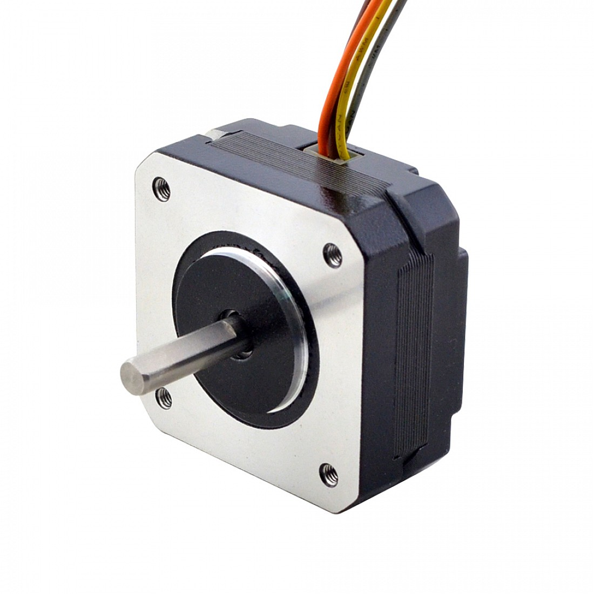

.. _bom:

Bill of Materials
=================

This directory contains the bill of materials for the hardware design of the Rotary Pendulum.

.. contents:: Table of Contents
   :local:
   :depth: 2

.. _electronics:

Electronics
^^^^^^^^^^^

Microcontroller
---------------

+--------------------------+--------------------------+----------+---------+--------------------------------------------------+
| Part Number              | Description              | Quantity | Price   | Details                                          |
+==========================+==========================+==========+=========+==================================================+
| `ESP32-DevKit`_          | ESP32 Development Board  | 1        | ~€10.00 | `EspSchematics`_                                 |
+--------------------------+--------------------------+----------+---------+--------------------------------------------------+

Motor Driver
------------

+--------------------------+---------------------+----------+--------+---------------------------------------------------+
| Part Number              | Description         | Quantity | Price  | Details                                           |
+==========================+=====================+==========+========+===================================================+
| `A4988`_                 | Stepper Motor Driver| 1        | ~€3.00 | `DriverSchematics`_                               |
+--------------------------+---------------------+----------+--------+---------------------------------------------------+

Power Supply
------------

The motor is powered using a 12V power supply. The ESP32 and other components are powered using a 5V power supply. The 5V power supply is generated using a step-down voltage regulator.

+--------------------------+---------------------+----------+--------+---------------------------------------------------+
| Part Number              | Description         | Quantity | Price  | Details                                           |
+==========================+=====================+==========+========+===================================================+
| `LM7805`_                | 5V Voltage Regulator| 1        | ~€0.50 |                                                   |
+--------------------------+---------------------+----------+--------+---------------------------------------------------+

Sensors
-------

Encoder
~~~~~~~

An incremental rotary encoder is used to measure the bar angle. The encoder has 600 pulses per revolution and it is powered using 5V.

+--------------------------+-------------------------+----------+--------+----------------------------------------------------+
| Part Number              | Description             | Quantity | Price  | Details                                            |
+==========================+=========================+==========+========+====================================================+
| `Rotary Encoder`_        | 600 P/R Incremental     | 1        | ~€20.00| `RotaryDatasheet`_                                 |
|                          | Encoder                 |          |        |                                                    |
+--------------------------+-------------------------+----------+--------+----------------------------------------------------+

Hall Effect Sensor
~~~~~~~~~~~~~~~~~~

+--------------------------+-------------------------+----------+--------+---------------------------------------------------+
| Part Number              | Description             | Quantity | Price  | Details                                           |
+==========================+=========================+==========+========+===================================================+
| `KY-024`_                | Linear Hall Effect      | 1        | ~€1.00 | `HallDatasheet`_                                  |
|                          | Sensor                  |          |        |                                                   |
+--------------------------+-------------------------+----------+--------+---------------------------------------------------+

Mechanics
^^^^^^^^^

Frame
-----

The frame is made out of an alluminium profile with a cross section of 20x20mm. The length of the profile is around 180mm.

You can use any other material with a different cross section, but make sure that the dimensions are compatible with the design and it is strong enough to sustain the stresses.

+--------------------------+---------------------+----------+--------+---------------------------------------------------+
| Part Number              | Description         | Quantity | Price  | Details                                           |
+==========================+=====================+==========+========+===================================================+
| `20x20mm Alluminium`_    | 20x20mm Alluminium  | 1        | ~€2.00 | `3D Model Profile`_                               |
|                          | Profile             |          |        |                                                   |
+--------------------------+---------------------+----------+--------+---------------------------------------------------+

3D Printed Parts
~~~~~~~~~~~~~~~~

You can find the 3D models of the parts in the :ref:`3d_models` section.
The parts were printed using PLA but you can use any other material (try avoiding rubber 😜).

I have also posted the models on Thingiverse and Cults3D:

- `Thingiverse`_
- `Cults3D`_

Motor
-----

+--------------------------+-------------------------+----------+--------+---------------------------------------------------+
| Part Number              | Description             | Quantity | Price  | Details                                           |
+==========================+=========================+==========+========+===================================================+
| `NEMA 17 Stepper Motor`_ | 17HS08-1004S            | 1        | ~€10.00| `MotorDatasheet`_                                 |
+--------------------------+-------------------------+----------+--------+---------------------------------------------------+

.. _ESP32-DevKit: https://docs.espressif.com/projects/esp-idf/en/latest/esp32/hw-reference/esp32/get-started-devkitc.html
.. _EspSchematics: https://dl.espressif.com/dl/schematics/esp32_devkitc_v4-sch.pdf
.. _A4988: https://www.pololu.com/product/1182
.. _DriverSchematics: https://www.pololu.com/file/0J450/a4988_DMOS_microstepping_driver_with_translator.pdf
.. _LM7805: https://www.sparkfun.com/datasheets/Components/LM7805.pdf
.. _Rotary Encoder: https://www.fruugo.it/600p-r-encoder-di-rotazione-incrementale-magnetoelettrico-5v24v-ab-2fasi-albero-6mm/p-120440516-253131421?language=en
.. _RotaryDatasheet: https://github.com/PeriniM/Rotary-Pendulum-RL/blob/main/hardware/BOM/datasheets/incremental_rotary_encoder_datasheet.pdf
.. _KY-024: https://arduinomodules.info/ky-024-linear-magnetic-hall-module/
.. _HallDatasheet: https://github.com/PeriniM/Rotary-Pendulum-RL/blob/main/hardware/BOM/datasheets/linear_magnetic_hall_sensor_datasheet.PDF
.. _20x20mm Alluminium: https://www.motedis.com/en/Aluminium-Profile-20x20-I-Typ-slot-5
.. _3D Model Profile: https://www.thingiverse.com/thing:6324741
.. _Thingiverse: https://www.thingiverse.com/thing:6377165
.. _Cults3D: https://cults3d.com/en/3d-model/various/rotary-pendulum-rl-open-source-project
.. _NEMA 17 Stepper Motor: https://www.omc-stepperonline.com/nema-17-high-temp-stepper-motor-16ncm-22-7oz-in-extruder-motor-insulation-class-h-180c-17hs08-1004s-h
.. _MotorDatasheet: https://github.com/PeriniM/Rotary-Pendulum-RL/blob/main/hardware/BOM/datasheets/nema17-17HS08-1004S.pdf
