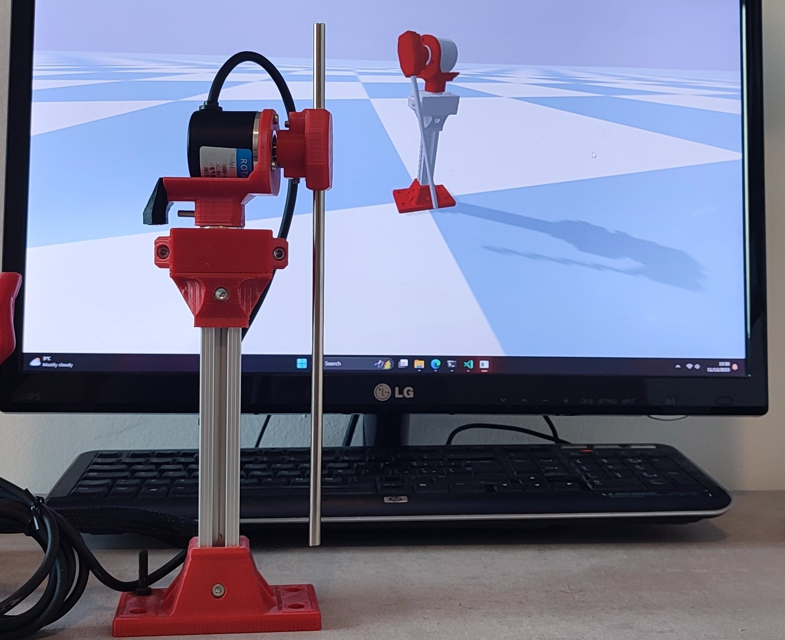

Overview
========

This is an open source project aimed at introducing people to **robotics**, from the hardware
and embedded systems implementation to the software and control algorithms.
The goal is to control a real life **rotary pendulum** to make it perform a swing-up and balance task.

The project is divided into four parts: **hardware**, **firmware**, **simulation** and **control**.

- The **hardware** part is responsible for the mechanical design and the electronic components.
- The **firmware** part is responsible for the embedded systems implementation.
- The **simulation** part is responsible for the simulation of the rotary pendulum in a virtual environment.
- The **control part** is responsible for the implementation of the control algorithms.