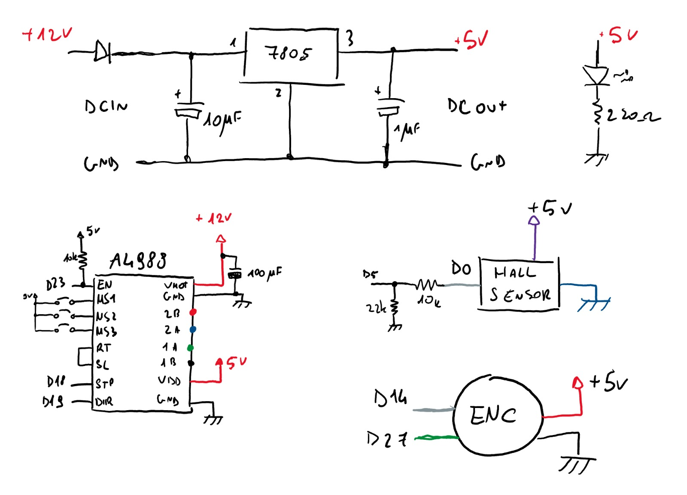

# Schematics

The schematics of the electronics are yet to be added to the repository. The following is the drawn schematic, the pin numbers represent the GPIO pins of the ESP32 and the ones used in the code.

